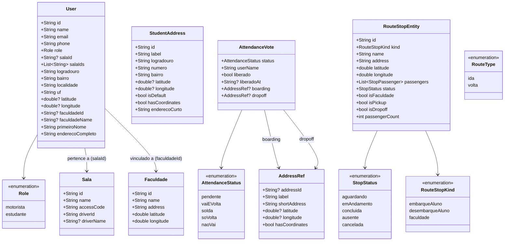
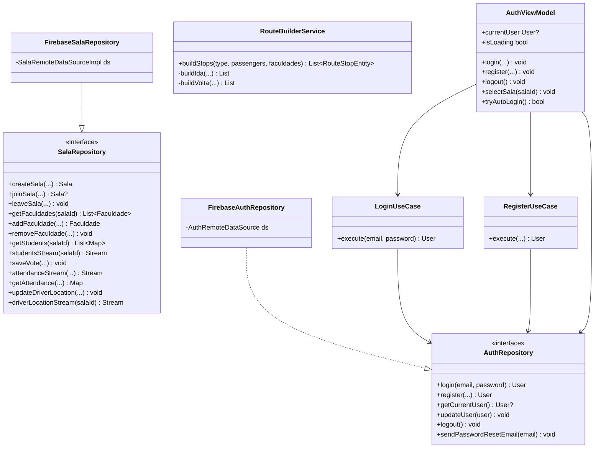
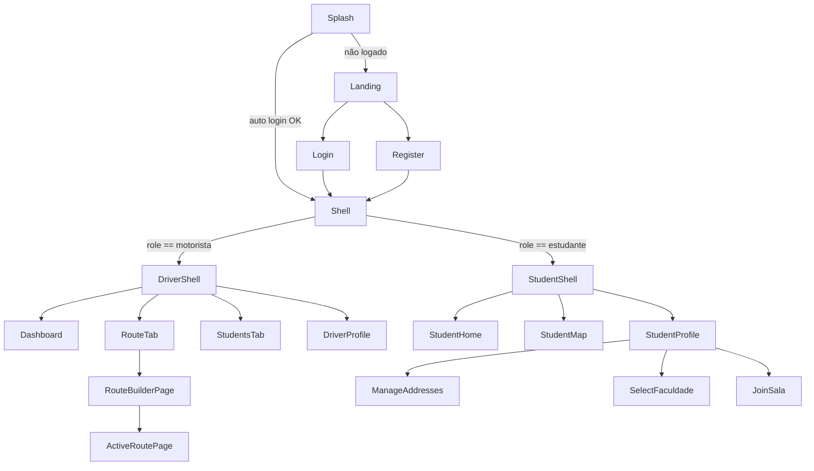

# UML — VanGo

## Diagrama de classes principal

```mermaid
classDiagram
  class User {
    +String id
    +String name
    +String email
    +String phone
    +Role role
    +String? salaId
    +List~String~ salaIds
    +String logradouro
    +String bairro
    +String localidade
    +String uf
    +double? latitude
    +double? longitude
    +String? faculdadeId
    +String? faculdadeName
    +String primeiroNome
    +String enderecoCompleto
  }

  class Sala {
    +String id
    +String name
    +String accessCode
    +String driverId
    +String? driverName
  }

  class Faculdade {
    +String id
    +String name
    +String address
    +double latitude
    +double longitude
  }

  class StudentAddress {
    +String id
    +String label
    +String logradouro
    +String numero
    +String bairro
    +double? latitude
    +double? longitude
    +bool isDefault
    +bool hasCoordinates
    +String enderecoCurto
  }

  class AttendanceVote {
    +AttendanceStatus status
    +String userName
    +bool liberado
    +String? liberadoAt
    +AddressRef? boarding
    +AddressRef? dropoff
  }

  class AddressRef {
    +String? addressId
    +String label
    +String shortAddress
    +double? latitude
    +double? longitude
    +bool hasCoordinates
  }

  class RouteStopEntity {
    +String id
    +RouteStopKind kind
    +String name
    +String address
    +double latitude
    +double longitude
    +List~StopPassenger~ passengers
    +StopStatus status
    +bool isFaculdade
    +bool isPickup
    +bool isDropoff
    +int passengerCount
  }

  class Role {
    <<enumeration>>
    motorista
    estudante
  }

  class AttendanceStatus {
    <<enumeration>>
    pendente
    vaiEVolta
    soIda
    soVolta
    naoVai
  }

  class RouteType {
    <<enumeration>>
    ida
    volta
  }

  class StopStatus {
    <<enumeration>>
    aguardando
    emAndamento
    concluida
    ausente
    cancelada
  }

  class RouteStopKind {
    <<enumeration>>
    embarqueAluno
    desembarqueAluno
    faculdade
  }

  User --> Role
  User --> Sala : pertence a (salaId)
  User --> Faculdade : vinculado a (faculdadeId)
  AttendanceVote --> AttendanceStatus
  AttendanceVote --> AddressRef : boarding
  AttendanceVote --> AddressRef : dropoff
  RouteStopEntity --> StopStatus
  RouteStopEntity --> RouteStopKind
```

---

## Diagrama de repositórios e casos de uso

```mermaid
classDiagram
  class AuthRepository {
    <<interface>>
    +login(email, password) User
    +register(...) User
    +getCurrentUser() User?
    +updateUser(user) void
    +logout() void
    +sendPasswordResetEmail(email) void
  }

  class SalaRepository {
    <<interface>>
    +createSala(...) Sala
    +joinSala(...) Sala?
    +leaveSala(...) void
    +getFaculdades(salaId) List~Faculdade~
    +addFaculdade(...) Faculdade
    +removeFaculdade(...) void
    +getStudents(salaId) List~Map~
    +studentsStream(salaId) Stream
    +saveVote(...) void
    +attendanceStream(...) Stream
    +getAttendance(...) Map
    +updateDriverLocation(...) void
    +driverLocationStream(salaId) Stream
  }

  class FirebaseAuthRepository {
    -AuthRemoteDataSource ds
  }

  class FirebaseSalaRepository {
    -SalaRemoteDataSourceImpl ds
  }

  class LoginUseCase {
    +execute(email, password) User
  }

  class RegisterUseCase {
    +execute(...) User
  }

  class RouteBuilderService {
    +buildStops(type, passengers, faculdades) List~RouteStopEntity~
    -buildIda(...) List
    -buildVolta(...) List
  }

  class AuthViewModel {
    +currentUser User?
    +isLoading bool
    +login(...) void
    +register(...) void
    +logout() void
    +selectSala(salaId) void
    +tryAutoLogin() bool
  }

  FirebaseAuthRepository ..|> AuthRepository
  FirebaseSalaRepository ..|> SalaRepository
  LoginUseCase --> AuthRepository
  RegisterUseCase --> AuthRepository
  AuthViewModel --> LoginUseCase
  AuthViewModel --> RegisterUseCase
  AuthViewModel --> AuthRepository
```

---

## Fluxo de navegação

```mermaid
flowchart TD
  Splash --> |auto login OK| Shell
  Splash --> |não logado| Landing
  Landing --> Login
  Landing --> Register
  Login --> Shell
  Register --> Shell

  Shell --> |role == motorista| DriverShell
  Shell --> |role == estudante| StudentShell

  DriverShell --> Dashboard
  DriverShell --> RouteTab
  DriverShell --> StudentsTab
  DriverShell --> DriverProfile

  RouteTab --> RouteBuilderPage
  RouteBuilderPage --> ActiveRoutePage

  StudentShell --> StudentHome
  StudentShell --> StudentMap
  StudentShell --> StudentProfile

  StudentProfile --> ManageAddresses
  StudentProfile --> SelectFaculdade
  StudentProfile --> JoinSala
```
