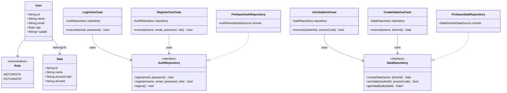

# UML (draft)

Notes:
- The repositories are interfaces in the domain layer.
- Firebase implementations live in the data layer and depend on data sources.
- Presentation (MVVM) consumes use cases via view models.
